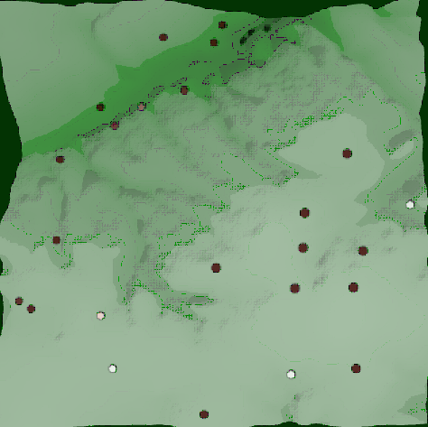

% Geo-Language Games: An Agent-Based Model of the Role of Terrain in Language Diversity
% Rachel Hendery, Liam Magee

# Geo-Language Games

Sample image

Sample Citation

[@hendery2015palmerston].

## References
